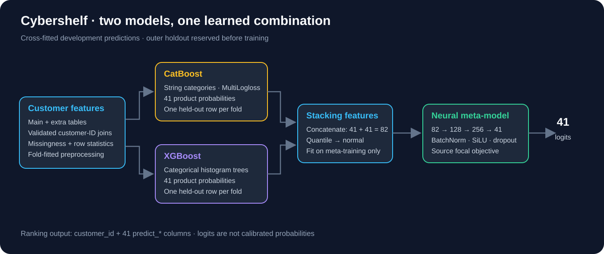
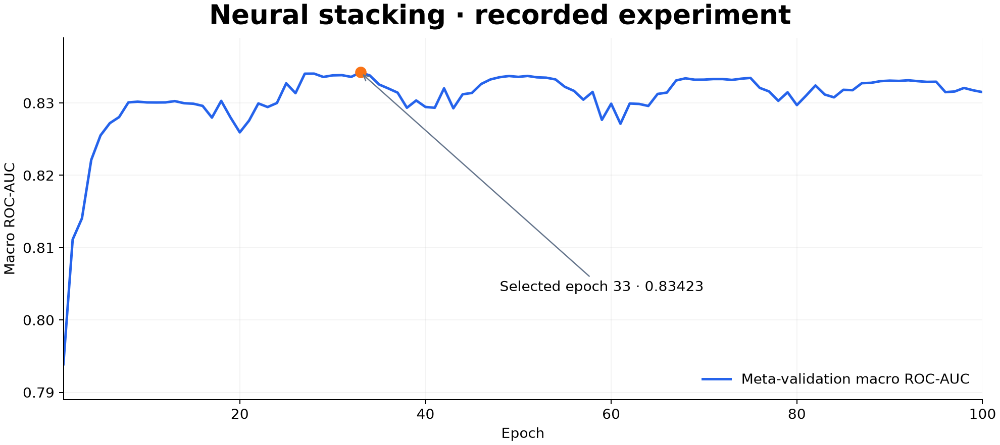

# Cybershelf — Banking Product Ranking

**Multi-label tabular learning for 41 banking products, combining CatBoost, XGBoost and neural stacking.**

[](https://github.com/IvanTriandofilidi/VTB_KiberPolka/actions/workflows/ci.yml)


I developed this solution for **Data Fusion Contest 2026, Task 2: Cybershelf**. The task is to rank each customer's likelihood of opening 41 financial products from anonymized numerical and categorical features. My approach combines the strengths of boosted trees with a small neural network that learns how to combine their product-level predictions.



## Problem at a glance

| Item | Competition setting |
|---|---|
| Learning task | 41 binary targets per customer |
| Data scale | 750,000 labeled customers; 250,000 test customers |
| Inputs | Main feature table and an optional wide extra-feature table |
| Challenges | Missing values, outliers, categorical codes, rare products and correlated labels |
| Metric | Macro ROC-AUC across all products |
| Submission | Parquet: `customer_id` plus 41 `predict_*` columns |

The business goal is product ranking. A high ROC-AUC does not by itself establish probability calibration or recommendation uplift.

## How the solution works

1. **Build a reliable customer table.** Join main features, extra features and labels by `customer_id`; validate uniqueness and preserve customer order.
2. **Add row statistics.** Capture missingness and numerical mean, standard deviation, minimum and maximum. Fit normalization on training rows.
3. **Train complementary tree models.** CatBoost uses native string categories and MultiLogloss. XGBoost uses categorical histogram trees and one output per target.
4. **Create cross-fitted predictions.** Each development customer gets held-out probabilities from both branches, yielding an 82-feature stacking matrix.
5. **Learn the combination.** A training-fitted QuantileTransformer feeds an MLP: `82 → 128 → 256 → 41`, with BatchNorm, SiLU, dropout and the source focal objective.
6. **Export ranking scores.** Refit the tree branches on development data, load the selected neural checkpoint and write 41 logits per customer.

The package reserves an outer holdout before base training, keeps meta-validation for checkpoint selection, and saves split IDs and model settings. [Evaluation protocol](docs/evaluation.md) explains the split boundaries and changes from the research experiment.

## Recorded experiment

The saved neural-training log reaches **0.83423 meta-validation macro ROC-AUC at epoch 33**. This is a historical checkpoint-selection result; it is not presented as a competition leaderboard score.



The refactored pipeline is verified on synthetic data. Full competition data and trained weights are not included, and the revised validation protocol has not been rerun at competition scale. Historical logs are preserved in [a machine-readable report](reports/historical-stacking.json).

## Quick start

```bash
git clone https://github.com/IvanTriandofilidi/VTB_KiberPolka.git
cd VTB_KiberPolka
python -m venv .venv
# macOS / Linux: source .venv/bin/activate
# Windows PowerShell: .venv\Scripts\Activate.ps1
python -m pip install -e ".[dev]"

# No credentials, competition records or trained weights required.
python -m cybershelf.demo --output runs/demo-data
cybershelf train --main runs/demo-data/main.parquet --extra runs/demo-data/extra.parquet --targets runs/demo-data/targets.parquet --output runs/smoke --folds 2 --iterations 8 --xgb-iterations 8 --epochs 2 --batch-size 128
cybershelf predict --main runs/demo-data/test.parquet --extra runs/demo-data/test_extra.parquet --model runs/smoke --output runs/demo-predictions.parquet
```

This small CPU run exercises joins, OOF generation, both tree models, neural training, artifact reload and submission export. Its accuracy is not a real-data benchmark. The [English walkthrough](notebooks/01_solution_walkthrough.ipynb) demonstrates data alignment, features, the model and output contracts. Install `python -m pip install -e ".[notebooks]"` to execute it in a Jupyter-compatible editor.

## Run on competition data

Obtain data from the competition provider and place it in `data/` following [the data contract](docs/data.md). GPU support requires an appropriate PyTorch installation and compatible tree-library drivers.

```bash
cybershelf train --main data/train_main_features.parquet --extra data/train_extra_features.parquet --targets data/train_target.parquet --output runs/full --device cuda
cybershelf predict --main data/test_main_features.parquet --extra data/test_extra_features.parquet --model runs/full --output runs/submission.parquet --device cuda

# Evaluate a separately prepared labeled dataset.
cybershelf evaluate --main data/holdout_main.parquet --extra data/holdout_extra.parquet --targets data/holdout_targets.parquet --model runs/full --output runs/holdout-predictions.parquet
```

Training defaults to five folds, CatBoost 3,500 iterations, XGBoost 1,000 iterations and 100 neural epochs. This can require substantial compute and memory. Numerical downcasting and chunked prediction reduce overhead; training still loads the feature tables in memory. Start with the synthetic example before scaling up. Load only model artifacts you trust; the pipeline bundle uses joblib serialization.

## Engineering decisions

- **Identity first:** ID-based joins replace positional label and prediction matching.
- **Fold-fitted preprocessing:** categories, missing-count scaling and quantile normalization use their respective training partitions.
- **Auditable OOF:** customer IDs, fold assignments, branch names and target order are saved alongside predictions.
- **Honest rare-target metrics:** undefined AUC is reported explicitly rather than replaced with 0.5.
- **Portable execution:** CPU defaults, configurable CUDA, a package entry point and automated integration checks.
- **Complete predictions:** partial inference batches retain every customer, with strict shape and finite-value checks.

The source also explores LightGBM, logistic regression for rare targets, feature selection and CatBoost classifier chains. These are documented as [research experiments](docs/experiments.md); they are not additional inputs to the final two-branch stack.

## Repository layout

```text
src/cybershelf/      Data contracts, features, trees, neural stacker, CLI
tests/              ID alignment, preprocessing, metrics and tensor contracts
notebooks/          English solution walkthrough
docs/               Data and evaluation protocols; architecture and curves
reports/            Recorded source history and execution verification
scripts/            Reproducible visualization generation
.github/workflows/  Unit tests and synthetic end-to-end run
```

```bash
ruff check src tests scripts
pytest -q
python scripts/plot_history.py
```

## Competition

[Data Fusion Contest 2026 — Cybershelf](https://ods.ai/competitions/data-fusion2026-cybershelf). Dataset access and reuse follow the provider's terms. Synthetic demo records are generated locally and contain no customer data.

Code is distributed under [Apache 2.0](LICENSE), consistent with the source notebook's license.
